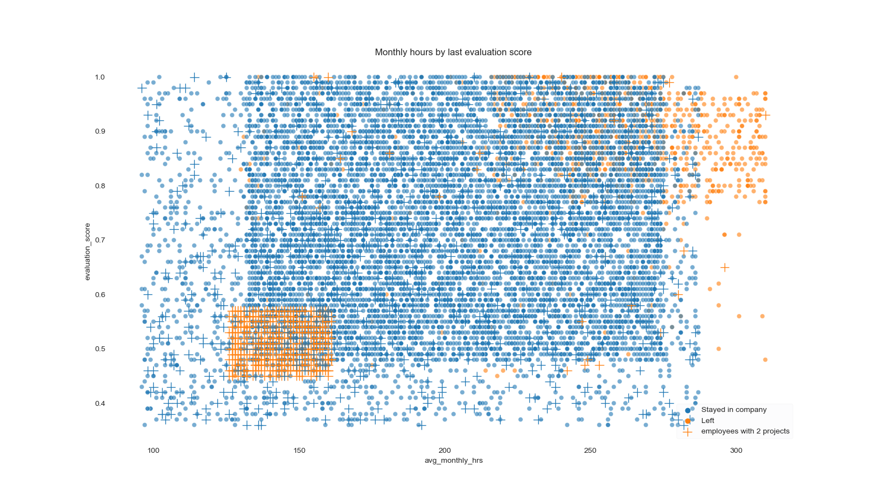

This is research was completed as the capstone project for [Google Advanced Data Analytics Professional Certificate](https://www.coursera.org/professional-certificates/google-advanced-data-analytics)

## Project overview

This is a project for:
* determining factors that drive employee departure
* building a model that will predict if an employee will quit the company

### Business context

Currently, there is a high rate of turnover among Salifort employees. Salifort’s senior leadership team is concerned about how many employees are leaving the company, since the high turnover rate is costly in the financial sense. If Salifort could predict whether an employee will leave the company, and discover the reasons behind their departure, they could better understand the problem and develop a solution.

## Approach

The aim is to build the most effective model to predict employee departure, explore factors driving employee turnover, and share recommendations for next steps with the leadership team. 

Data

The [dataset](HR_capstone_dataset.csv) contains 14,999 rows – each row is a different employee’s self-reported information

Variable  |Description |
-----|-----|
satisfaction_level|Employee-reported job satisfaction level [0&ndash;1]|
last_evaluation|Score of employee's last performance review [0&ndash;1]|
number_project|Number of projects employee contributes to|
average_monthly_hours|Average number of hours employee worked per month|
time_spend_company|How long the employee has been with the company (years)
Work_accident|Whether or not the employee experienced an accident while at work
left|Whether or not the employee left the company
promotion_last_5years|Whether or not the employee was promoted in the last 5 years
Department|The employee's department
salary|The employee's salary range (low / medium / high)

### Steps
#### 1 .EDA
First, I performed data preparation: dropped duplicated rows, encoded categorical variables (salary and department).

Through data exploration, I identified two clusters of people who left the job.: 
*  

Overworking employees

    Those who worked 240–300+ hours per month (mean monthly 200), participated in many projects and had a high evaluation score (> 0.8). These employees often have a critically low satisfaction score (<0.15). 

* 

Uninvolved employees

   A group of employees who were engaged only in minimal number of projects (2) and had a low evaluation score (<0.6), regular working hours (<160) a low satisfaction level (<0.5).

Illustrative Plot

Further analysis revealed that the salary range does not seem to correlate with the number of projects. A pairplot examination revealed that a very low percentage of employees received promotions in the past 5 years. These findings may indicate a potential cause for the low level satisfaction and subsequent resignation. 

#### 2. Model building
Using grid search, I fitted a decision tree model and a random forest model, using roc_auc metric for refitting.
I then compared the metrics on a test set for the two best estimators. Decision tree won by a very tiny margin (cf the [result table](model_res_comparison.csv)), so I proceeded to test it on a validation set.

#### 3. Model evaluation

Metrics for the chosen model on the validation set are as follows:

precision |recall|F1|accuracy|AUC
-----------|-----|-----|-----|-----
0.97| 0.91      | 0.94      | 0.98      |0.95

The model identified these features as the most important ones.

**Disclaimer:** since satisfaction level is a value that does not indicate a root cause for (dis)satisfaction, so I'm also planning to perform an analysis without it.

#### 4. Formulating recommendations

The conclusion I drew from the analysis is that it is very important to address the issue of overworking. Since both the number of projects and average monthly hours contribute to employee departure, the company needs measures to cap both.

It was also very clear at the EDA stage that, overall, people tend to work longer hours than what is considered standard. 

Another thing that came up during this stage is an extremely low rate of promotions in the company.

You can see the detailed list of my recommendations in the last section of the [notebook](Project.ipynb).
