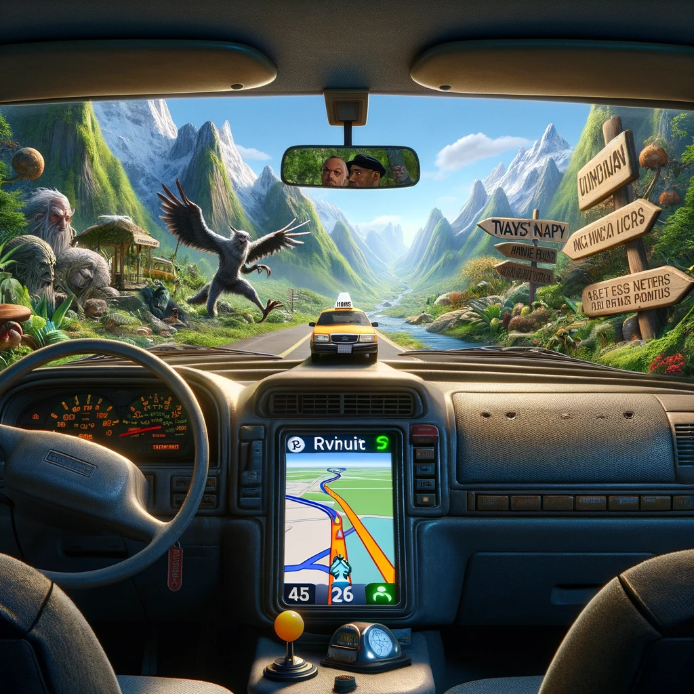

## Data Science Portfolio
### Anastasia Vyunova
* **email:** anastasia.vyu@gmail.com
* **Telegram:** [t.me/anastasia_vyu](https://t.me/anastasia_vyu)
* **LinkedIn:** [linkedin.com/anastasia-vyunova](https://www.linkedin.com/in/anastasia-vyunova-7bb8aa234/)

### Projects

---

### [Predicting employee quit factors](https://github.com/point-de-vyu/data-analytics-projects/tree/main/Predicting_employee_quit_factors)

A company's senior leadership team is concerned about high rate of turnover among their employees, so they want to predict whether an employee will leave the company, and discover the reasons behind their departure. I'm building several categorization models in order to address this business need.

 

---

### [Predicting user churn](https://github.com/point-de-vyu/data-analytics-projects/tree/main/Waze_predicting_user_churn)

Using EDA practices and categorization models to understand who the users who churn are, when and why they do it, for the mobile navigation app Waze. 

 

---

IN RUS

В этом репозитории представлены мои учебные и пет-проекты дата аналитике. 
Детали и результаты каждого проекта можно найти в соответствующих файлах README.
Так как учебные проекты были выполнены в рамках англоязычных курсов, ответы и комментарии внутри ноутбуков тоже на английском. Как и ридми :) 
Надеюсь, это не станет для вас препятствием. А если станет, пожалуйста, обращайтесь с вопросами.

---
### Certifications

[Google Advanced Data Analytics Professional Certificate](https://coursera.org/share/9da4e8e4a88ae4283ab6baea83d094be)

### **My other projects**

* [Tableau vizzes](https://public.tableau.com/app/profile/anastasia.vyu/vizzes), including interactive maps and various charts

* [Mental health assistant telegram bot](https://github.com/point-de-vyu/mindfulness-assistant)