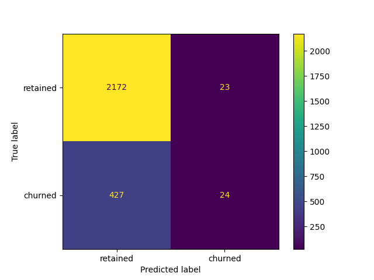
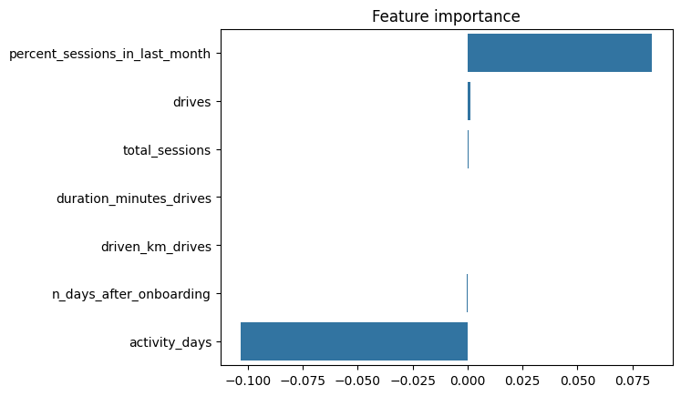

This is research was completed as the capstone project for [Google Advanced Data Analytics Professional Certificate](https://www.coursera.org/professional-certificates/google-advanced-data-analytics)

## Project overview
Status - WIP.

The objectives of this project are:
* building a model that can predict user churn
* answer questions such as _Who are the users most likely to churn?_, _Why do users churn?_, _When do users churn?_ 

### Business context

> Waze’s free navigation app makes it easier for drivers around the world to get to where they want to go. Waze’s community of map editors, beta testers, translators, partners, and users helps make each drive better and safer. Waze partners with cities, transportation authorities, broadcasters, businesses, and first responders to help as many people as possible travel more efficiently and safely. 

Data

The [dataset](waze_dataset.csv) contains 14,999 rows – each row represents one unique user

Variable  |Description |
-----|-----|
ID |A sequential numbered index
label | Binary target variable (“retained” vs “churned”) for if a user has churned anytime during the course of the month 
sessions | The number of occurrence of a user opening the app during the month
drives | An occurrence of driving at least 1 km during the month
device | The type of device a user starts a session with
total_sessions | A model estimate of the total number of sessions since a user has onboarded
n_days_after_onboarding | The number of days since a user signed up for the app
total_navigations_fav1 | Total navigations since onboarding to the user’s favorite place 1
total_navigations_fav2 | Total navigations since onboarding to the user’s favorite place 2
driven_km_drives | Total kilometers driven during the month
duration_minutes_drives | Total duration driven in minutes during the month
activity_days | Number of days the user opens the app during the month 
driving_days | Number of days the user drives (at least 1 km) during the month

## Steps

### 1. Exploratory data analysis and feature engineering
At this stage, I checked for NaNs, outliers, and engineered features that might contribute to finding answers.
While exploring the engineered features I found quite a lot of entries that raised suspicion, since they were (borderline) physically impossible, e.g. _200 drives per day on average_ or _8 thousand km per drive_. I removed such entries based on my domain knowledge and intuition.

### 2. Hypothesis testing
I performed a t-test to determine if there is a statistically significant difference in the number of drives between iPhone and Android users.
The null and alternative hypotheses were as follows:
* H0: mean drives are the same for iPhone and Android users
* Ha: mean drives are different depending on the OS

With the P-value of 0.14, I failed to reject the hypothesis. This means that there is no statistical significance in the difference of the mean rides between Android and iPhone users.

### 3. Logistic regression to predict churn
Using sklearn `LogisticRegression`, I built a logistic regression model to try and predict user churn.

Checked model assumptions:
* Little to no multicollinearity among X predictors
* Linear relationship between x and the logit of y

Here are the results:

Classification report

label | precision  | recall | F1 | accuracy
-----|-----|-----|-----|-----|
retained |0.84 | 0.99| 0.91 |
churned | 0.51 | 0.05 | 0.10 |
| | | |      | 0.83

Confusion matrix

Feature importance

This model has mediocre precision and very low recall, which means that it makes a lot of false negative predictions and fails to capture users who will churn.

### 4. Tree-based models (Random Forest, XGBoost) to predict churn

Using grid search, I trained two tree-based models: `RandomForestClassifier` and `XGBClassifier` and compared their performance.

Metric comparison on the train and validation set:

model | precision | recall | F1 | accuracy
-----|----------|-----|-----|-----|
Random Forest: train | 0.445412 |	0.110868 | 0.177012 | 0.824389
XGB: train| 0.387709 | 0.153741 | 0.219431 | 0.813427
Random Forest: validation | 0.491803 | 0.133038 | 0.209424 | 0.828798
XGB: validation | 0.430168 | 0.170732  | 0.244444  |0.820106

XGBClassifier's metrics on the test set:

label | precision  | recall | F1   | accuracy 
-----|-----|-----|------|-----|
retained | 0.85 | 0.95 | 0.90 | 
churned | 0.42 | 0.16| 0.23 |
| | | |      | 0.82

Again, the metrics show that this model is bad at predicting user churn.

## Conclusions so far

The results are unsatisfactory, none of the models is good at predicting users who are likely to churn. The data needs further investingation and modeling.